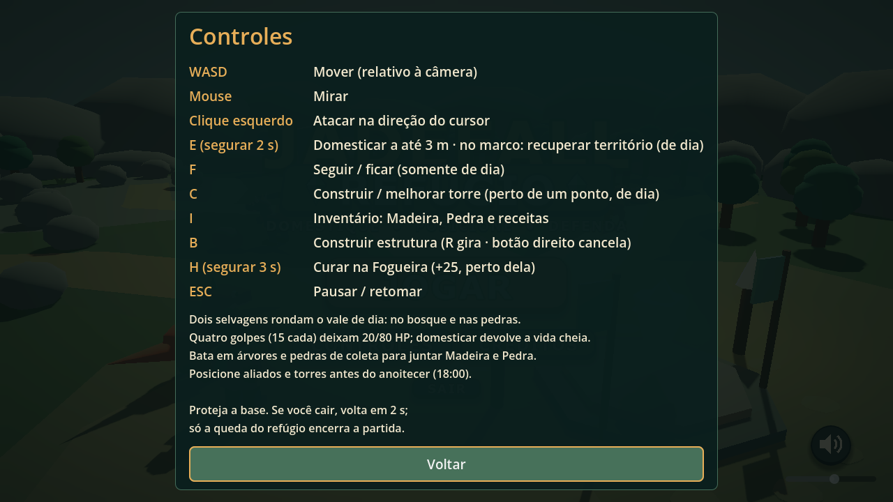

# Controles da versão entregue

A tabela canônica está no [GDD atualizado](../../ac1/GDD_AC1.md#controles-reais), extraída de InputMap e scripts, e é repetida no [README do projeto](../../../README.md).

Diferenças em relação ao material antigo: mouse mira, não gira câmera; dano atual é 15; N/T são debug desativado; I/B/R/H/C estão implementados. Esc fecha painéis/cancela construção antes de pausar. E também recupera território liberado durante o dia.
