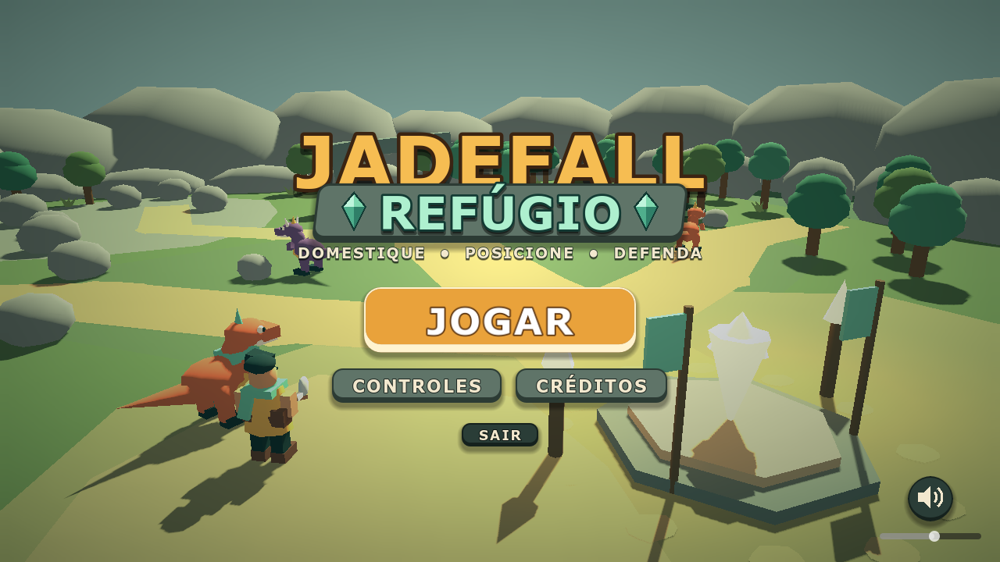

# Identidade do estúdio e do jogo

## Nomes e fontes

- **Estúdio: Inity Pixel** — grafia dos créditos e marca existente. [Logo SVG](../../ac1/assets/logo_inity_pixel.svg), [PNG](../../ac1/assets/logo_inity_pixel.png), [símbolo do runtime](../../../assets/ui/inity_mark.svg).
- **Jogo: Jadefall: Guardiões do Refúgio** — nome definido para a entrega. [Assinatura SVG](logo-infinity-pixel.svg), derivada da tipografia, faixa e cristais já usados em `main.gd`.
- `Infinity Pixel (4.7)` é nome técnico da aplicação; engine utilizada: 4.6.2.

O arquivo histórico `docs/ac1/assets/logo_jogo.svg` diz **Tower Defense Dino**. Não usar esse logo antigo como identidade atual. Nenhum nome novo foi inventado. A assinatura vetorial de entrega adapta a identidade existente; não substitui o logo já renderizado pelo menu nem altera o gameplay.

## Estúdio

Símbolo de pixels jade/âmbar, nome em caixa alta e espaço livre ao redor de ao menos a largura de um bloco. Aplicar a marca clara sobre fundo verde profundo; preservar proporções. Marca institucional separada do título do jogo, com identificação “Estúdio de jogos” quando houver espaço. A identidade documentada e a autoria assistida por IA precisam de aprovação final da equipe.

## Jogo

Título **JADEFALL** em âmbar, **GUARDIÕES DO REFÚGIO** em jade, faixa de pedra verde e cristais laterais. Formas sólidas, contornos escuros, legibilidade sobre cenário natural. A aplicação de referência é o menu atual; a versão SVG funciona em pranchas e apresentação.

Paleta institucional: verde profundo #102B2A; floresta #24554A; jade #69BE9B; âmbar #E7AE58; coral #C76C4C; creme #F2E8CE. No título atual, destaque #F6BD52 e jade claro #AEF0CF, faixa #5F7468. Usar coral para dano/ameaça e jade para vida/vínculo, sem depender só da cor para transmitir estado.

Tipografia de entrega: sans-serif forte (Arial/Segoe UI disponíveis no sistema), títulos em caixa alta e corpo legível. Não esticar logo, recolorir arbitrariamente ou usar a arte antiga com nome divergente. Não redistribuímos fontes comerciais.

Anexos do card: logo do estúdio, assinatura do jogo e este guia; a prancha visual está no slide 14 da apresentação. Aprovação de marca/lore pelo grupo não deve ser confundida com produção do arquivo.
