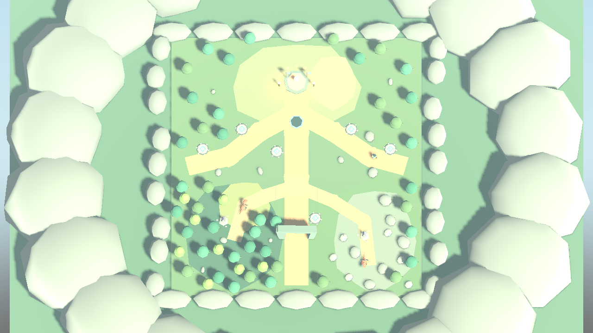
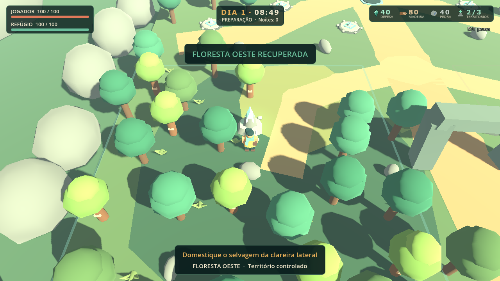

# Level design — mapa atual

Captura gerada pelo Godot em 07/10/2026 a partir da cena real. Câmera panorâmica temporária do teste `map_showcase`: não modifica a câmera/jogabilidade da partida. **Nesta imagem, o sul/Refúgio fica em cima e o norte/ruína embaixo**; oeste permanece à esquerda. A vista é ortográfica inclinada, não levantamento cartográfico exato. Limites do chão: X −24…24, Z −24…28 (48 × 52 m).

| Elemento | Localização X/Z | Função |
|---|---|---|
| Refúgio | 0 / −15, parte superior da imagem | Cristal/base de 100 HP; sua destruição causa derrota |
| Spawn/respawn | 0 / −10 | Jogador começa diante da base |
| Zona central | Eixo x≈0, bifurcações | Circulação entre base, rotas e exploração |
| BuildZone | Polígono ao sul/leste do Refúgio em world_regions.tscn | Construção inicial de Fogueira, respeitando chão livre |
| Floresta Oeste | x −24…−4; z 5,5…28 | Guardião, oito árvores coletáveis, marco (−14,13) |
| Região Rochosa | x 4…24; z 5,5…28 | Guardião, seis pedras coletáveis, marco (13,16) |
| Corredor selvagem/ruína | Norte, eixo central; entrada (0,23) | Rota de onda; não conquistável |
| Entradas laterais da onda | Próximas de (−20,2) e (20,2) | Pressão por três rotas, com variações de spawn |
| Torres | Seis plataformas com cristal | Pontos fixos de defesa, dois por identificação de rota |

Pontos defensivos exatos: (−10,5;−5,5), (−18;−1,5), (−3,8;−1), (3,6;12,5), (10,5;−5,5), (18;−1,5). Referência: `prototype_area.tscn`.

## Progressão territorial desenhada

**Refúgio controlado (1/3)** → neutralizar guardião oeste ou leste → marco pronto → E por 2 s de dia → **região recuperada (2/3)** → repetir na outra região → **3/3**.

A conquista permite construção de base nas regiões, mas não permite bloquear rotas ou ignorar colisões. Armadilhas continuam exigindo rotas; torres continuam nos seis slots. Conquista não aumenta o mapa. Reinício retorna a 1/3; morte do avatar não perde a conquista.

As rotas laterais e a estrada central chegam ao Refúgio; as regiões de coleta ficam fora dessas rotas noturnas. Colisões de árvores/rochas e navegação já existem. Nenhum mapa novo foi criado nesta revisão. A prancha da apresentação usa esta captura com explicação; a planta antiga de 40×40 não é evidência do mapa atual.
