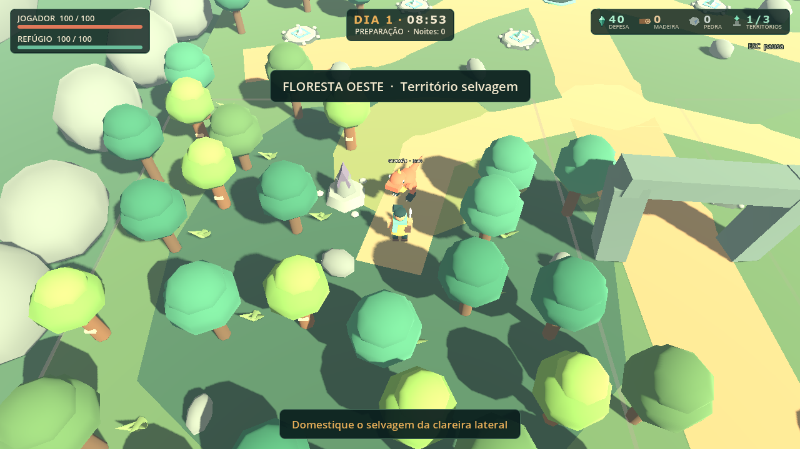
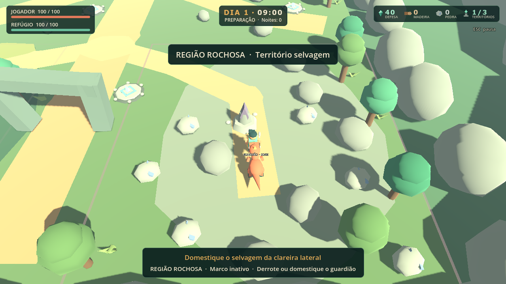
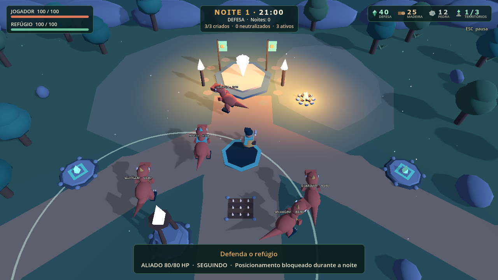

# Moodboard — direção do próprio jogo

Prancha visual na apresentação, slide 13, e na [galeria de entrega](galeria.html). Fontes são modelos e capturas deste projeto; não foram copiadas obras externas.

| Eixo | Direção observada / regra visual |
|---|---|
| Formas | Polígonos visíveis, volumes simples, caudas e cristas para identificar criaturas |
| Cores | Floresta/verde profundo no mundo e UI; jade para vínculo/vida, âmbar para foco, coral para dano |
| Iluminação | Manhã clara, pôr do sol quente, noite fria; fontes locais de cristal, tochas e Fogueira |
| Ambiente | Vale cercado por rochas, bosque oeste, clareira central e região rochosa leste |
| Personagem | Túnica, lenço, bolsa e machado; escala humana e silhueta de Guardião |
| Criaturas | Dino bípede com cauda/crista; aliado sinalizado em jade; Carnotauro como variante de modelo |
| Arquitetura | Refúgio de pedra/cristal, estandartes, arco/ruína e torres compactas |
| UI | Painéis verde-escuros, texto creme, barras reais e ícones acompanhados de nomes/números |
| Materiais | Pedra fosca, madeira, vegetação de cores chapadas, cristais emissivos |
| Conceitos | Abrigo, vínculo, natureza perigosa, preparação e resistência noturna |

Paleta: #102B2A · #24554A · #69BE9B · #E7AE58 · #C76C4C · #F2E8CE. Usar contraste de forma/texto além de cor. A estética é a do protótipo; não promete modelos de maior fidelidade ou novos biomas.
